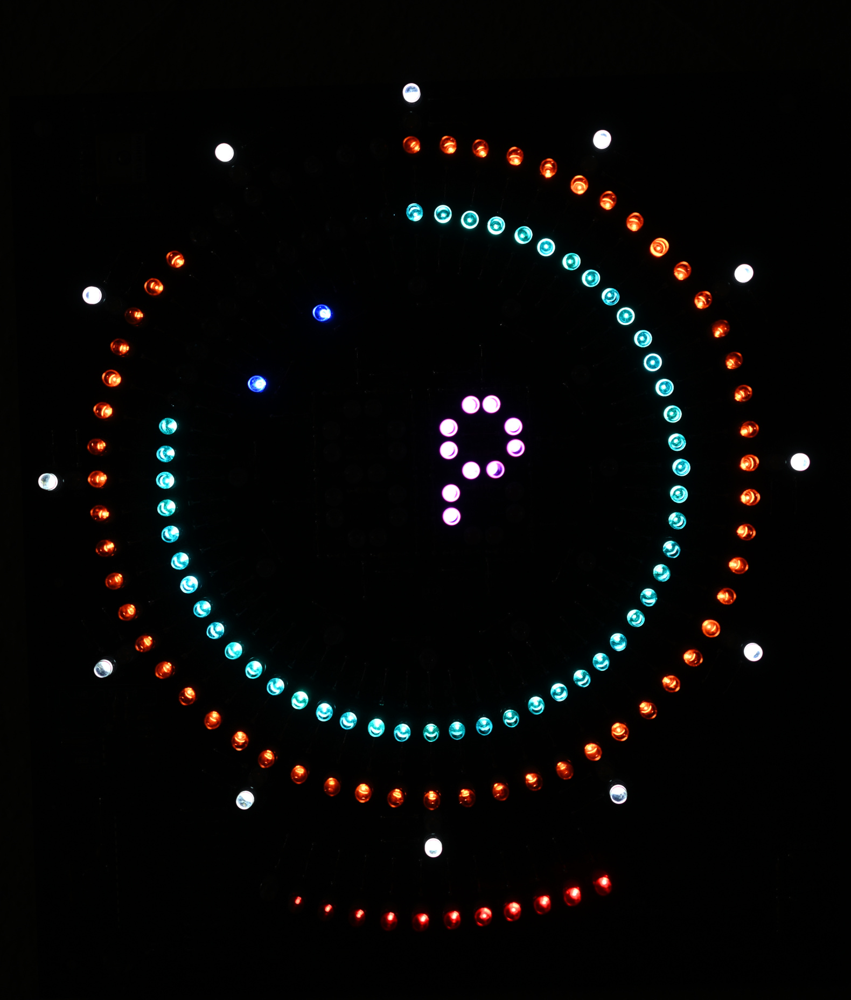
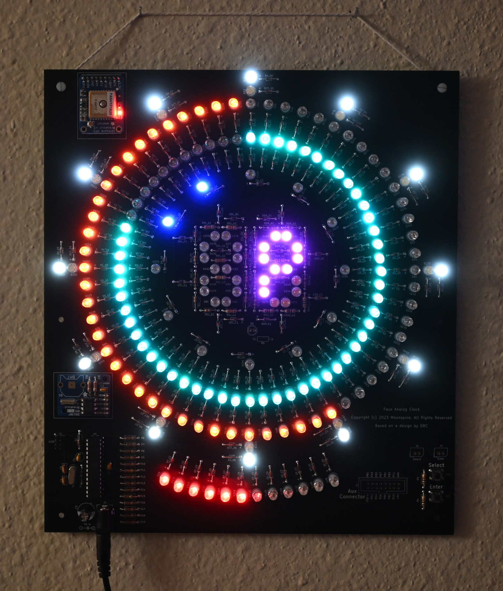

# Faux Analog Clock

An analog clock composed entirely of LEDs

The build should be fairly self-explanatory. A KiCad 6 schematic and board layout are included in `Board\`  
Additionally, `Board\Faux Analog Clock Gerber.zip` is a ready-to-go Gerber plot of the board which can be sent directly to the PCB manufacturer of your choice.  
LED resistor values are mere suggestions, and you should experiment on a breadboard to see what works well with your chosen LEDs.  

The following photos show the clock operating with its "Fill 2" (F2) display mode active:  




# Debugging the build

In order to facilitate easier debugging during the build process, two LED tests are easily accessible on startup.  

If you press and hold "Select" as you turn the clock on, it will boot in "LED test 1" mode.  
This mode displays all LEDs at full brightness to help track down bad solder joints, backwards diodes, etc.  
This test mode is accessible via the utilities menu after startup. Press any key to resume the normal boot sequence.  

If you press and hold "Enter" as you turn the clock on, it will boot in "LED test 2" mode.  
This mode displays each LED in sequence. This is useful for tracking down solder bridges and confirming proper clock operation.  
This test mode is also accessible via the utilities menu after startup. Press any key to resume the normal boot sequence.  


# Using the menu

Press "Select" or "Enter" to enter the menu.  
Subsequent presses of "Select" will advance to different menu options.  
Pressing "Enter" will choose a menu option (either changing a setting or opening a submenu.)  
Pressing and holding "Select" for the amount of time defined by MENU_BACK_BUTTON_LONG_PRESS_MS will return to the previous menu (or close the menu if at the top menu.)  
If no buttons are pressed for MENU_TIMEOUT_MS milliseconds, the menu will close on its own.


## Main menu options
- tZ (72) = Timezone
- dS (d5) = Daylight Saving Time
- FE (FE) = Face effects (Clock face ring effects)
- Fd (Fd) = Fade effects
- br (br) = Brightness
- nb (nb) = Night brightness (multiplied by brightness)
- dY (d4) = Display mode
- Pd (Pd) = Pendulum period
- UT (U7) = Utilities


## Timezone menu

In this menu, you can select the timezone offset of the clock, in whole hour increments.  
These values are displayed in hexadecimal (sorry, 7-segment displays) ranging from "-C" (-12 hours) to "E" (+14 hours)


## Daylight Saving Time menu

In this menu, you can set whether DST is in effect ("Y") or not ("n")


## Face Effects menu

This menu controls the face edge lighting.
- "on" = Face effects are turned on (fading between inner and outer at sunrise/sunset)
- "ou" = Face effects are turned off, always light outer clock face ring
- "in" = Face effects are turned off, always light inner clock face ring
- "bo" = Face effects are turned off, always light both clock face rings


## Fade Effects menu

This menu turns the LED intensity fade effects on ("Y") or off ("n")


## Brightness menu

This menu controls overall clock LED brightness from 1 (dimmest) to 10 (brightest).


## Night Brightness menu

This menu controls overall clock LED brightness at night (from 6 PM to 6 AM) from 1 (dimmest) to 10 (brightest).  
This value is multiplied by the overall clock brightness, making it effectively a scalar for clock brightness that's only applied at night.


## Display mode menu

This menu allows you to select between different clock face display modes.
- "An" = Analog mode. This is the classic analog clock face, showing one LED for hours, one for minutes, and one for seconds.
- "bn" = Binary mode. This mode displays H/M/S in binary. The LSb is at 12 o'clock, and the bits are displayed in clockwise order from there. The hours use 3 LEDs per bit (displaying a 4-bit number in total), and the minutes and seconds each use 10 LEDs per bit (displaying a 6-bit number).
- "F1" = Fill mode 1. This mode fills the hour/minute/second rings as time progresses, clearing them at the turn of the minute/hour.
- "F2" = Fill mode 2. This mode fills the hour/minute/second rings on even minutes/hours/AM (respectively), and empties the rings on odd mintes/hours/PM.
- "In" = Inverted analog mode. This is the same as analog move, except that the LEDs are inverted.


## Pendulum period menu

This menu allows you to set the period of the pendulum.
- "FA" = Fast (1 second)
- "SL" = Slow (2 seconds)


## Utilities menu

This menu includes some useful utilities for testing your clock build.
- "RS" ("r5") = Reset the current time using the GPS
- "L1"        = Run LED test 1 (light all LEDs at max intensity) (press any button to end)
- "L2"        = Run LED test 2 (light LEDs at max intensity sequentially) (press any button to end)


# Customizing the clock

## Faux_Analog_Clock.ino

At the top of `Firmware/Faux_Analog_Clock/Faux_Analog_Clock.ino`, you can find many constants defined which alter the behavior of the clock.

You can change the fade animation rate by modifying variables in the "Animation timing variables" section.
- CLOCK_ANIM_*_FADE_TIME = The number of microseconds between each time the LEDs fade by 1 unit of intensity (255 is the max LED intensity)

Menu behavior can be configured as well:
- MENU_TIMEOUT_MS                = The number of milliseconds until the menu auto-closes after the last button press.
- MENU_BACK_BUTTON_LONG_PRESS_MS = The number of milliseconds the user must hold the "Select" button to return to the previous menu.

You can also change how often the GPS is used to set the RTC:
- TIMEKEEPER_GPS_TIME_SET_INTERVAL_SECONDS = Seconds in between time resets.


## ClockFace.h

FACE_INNER_HOURLY_BRIGHTNESS and FACE_OUTER_HOURLY_BRIGHTNESS define the brightness of the inner and outer edge rings on a per-hour basis.  
The first entry in each array is the brightness at midnight (hour 0), and the rest of the entries count up from there (1 AM, 2 AM, etc.)


## Pendulum.h
PENDULUM_LED_INDEX contains the LED indices of the pendulum for each individual millisecond following a second tick.  
The default pattern is a sinusoidal pendulum pattern that starts in the center and swings right then left.


## Timekeeper.h

In `Firmware/Faux_Analog_Clock/Timekeeper.h`, commenting out the following line will cause the timekeeper to use an internal millis()-based RTC rather than external RTC hardware:
```
#define USE_HARDWARE_RTC 1
```

You can also modify the amount of time that the timekeeper will attempt to get a fix before forcibly resetting the GPS (the default is 15 minutes):
```
#define GPS_RESET_TIMEOUT_MS 900000
```

